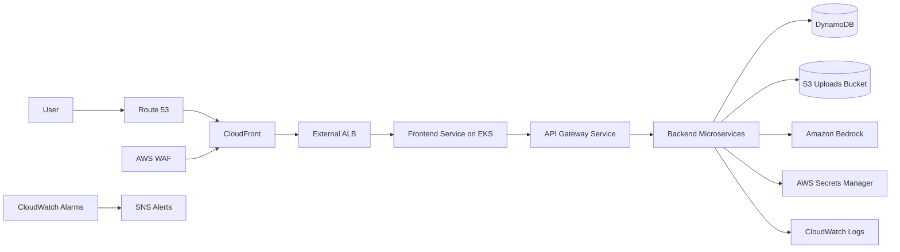

# MedicoJobs EKS Architecture

## Request Flow

`User -> Route 53 -> CloudFront -> WAF -> External ALB -> Frontend Service -> Backend Microservices -> DynamoDB/S3/Bedrock`

## Notes

- Terraform creates the EKS cluster, node group, IAM, Route 53, KMS, S3, DynamoDB, Secrets Manager, CloudWatch, SNS, ECR, and add-ons.
- Argo CD deploys Kubernetes workloads from the Helm GitOps repository.
- The external ALB is created by the AWS Load Balancer Controller from the Kubernetes Ingress.
- CloudFront/WAF is optional until the ALB DNS name is known. Set `cloudfront_enabled = true` and `external_alb_dns_name = "<alb-dns>"` after the ingress creates the ALB.
- CloudFront uses its default `*.cloudfront.net` domain because this setup intentionally avoids ACM certificates. AWS requires an ACM certificate in `us-east-1` for custom Route 53 names on CloudFront.
- Private worker-node subnets use gateway VPC endpoints for S3 and DynamoDB, reducing NAT Gateway traffic and keeping service access on the AWS network.
- Application workloads should annotate their service accounts with `workload_irsa_role_arn` for DynamoDB, S3, Secrets Manager, KMS, and Bedrock access.
